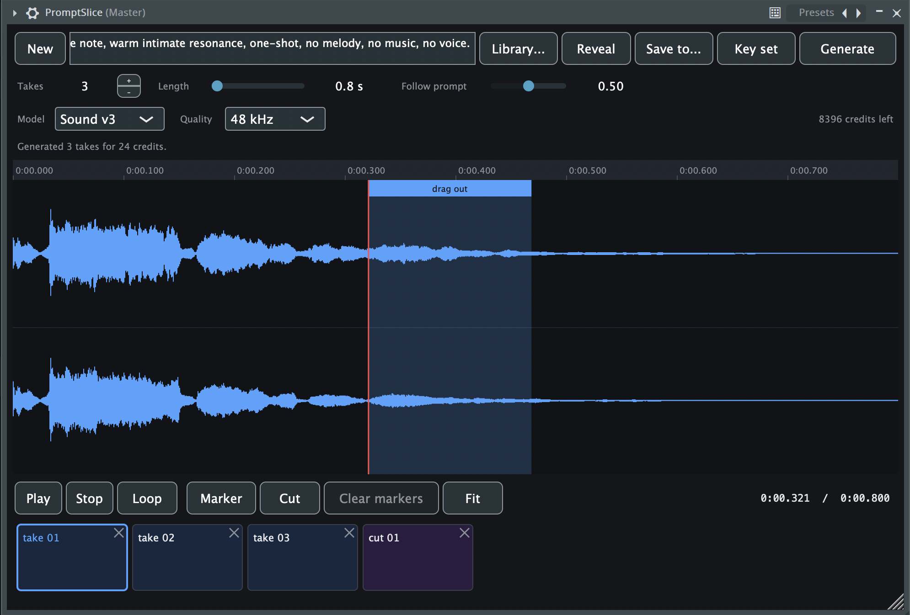

<div align="center">

# PromptSlice

**The ElevenLabs sound generator, without leaving your DAW.**

[](https://github.com/vasylNaumenko/promptslice/releases/latest)
[](https://github.com/vasylNaumenko/promptslice/releases/latest)

<sub>VST3 · AU · standalone — free, and you bring your own
<a href="https://elevenlabs.io">ElevenLabs</a> key.<br>
The builds are unsigned: macOS needs
<a href="#getting-it">one command</a> before it will load them.</sub>

[](https://github.com/vasylNaumenko/promptslice/actions/workflows/build.yml)
[](https://github.com/vasylNaumenko/promptslice/releases/latest)
[](LICENSE)
[](https://juce.com)

</div>



[ElevenLabs](https://elevenlabs.io) makes the sound effect. PromptSlice is the
VST3 / AU plugin you work with it in: ask for a handful of takes from inside the
project, hear them against the track that is already playing, mark up the one
that worked, cut the piece you want out of it and drag it onto a channel.

What it removes is the round trip. A browser tab, a download folder, a file
manager, and all of it again for the next take — for a sound you will keep two
seconds of.

VST3 and AU, so it loads anywhere that takes them — Ableton, Logic, Reaper,
Bitwig, Cubase, Studio One. It was written and tested in FL Studio 2026, and
that is the one host where the last step is *proven*: dragging a cut into the
project is a file drop the host has to accept, and hosts differ. If yours does
something else, that is worth an issue.

---

## What it does

|  |  |
|---|---|
| **Several takes at once** | A prompt gives one sound, so asking for five is five requests — and the first plays while the rest are still arriving. |
| **The whole editing bit** | Playhead, markers, a selection, looping, cutting. Cuts land on the nearest zero crossing within 10 ms and the last millisecond fades, so a piece does not click at either end. |
| **Lossless** | Takes are requested as PCM rather than the endpoint's default of 128 kbps mp3, which smears exactly the transients a one-shot is made of. |
| **Honest about money** | Every request reports what it cost, and the plugin shows that figure rather than guessing against a price list. |
| **Nothing is lost** | What each batch was asked for is written beside the sounds it made, and **Library** opens it again — prompt, settings and all. |

### Why dragging, and not an Import button

There isn't one. VST3 gives a plugin no way to create a channel, place a clip, or
write anything into the host's project — that is not an omission here, it is the
format. What a plugin *can* do is write a file and let the host accept a drop of
it, which is how Serato Sample, XO and Portal all do it too. So every piece you
cut lands in the row at the bottom, and you drag it where you want it.

---

## Getting it

Built releases are on the [releases page](https://github.com/vasylNaumenko/promptslice/releases)
— a zip per system, with where to put things and what macOS will say about it.

> [!IMPORTANT]
> Those builds are **not signed or notarised**, which needs a paid Apple
> developer account. macOS will refuse to load a downloaded plugin until you
> clear the quarantine mark by hand; the release notes give the command. If you
> would rather not take that on trust, build it yourself — it is three lines.

## Building

You need **CMake 3.22+** and a **C++20 compiler**. JUCE is fetched automatically
at the version this was tested against — if you already have a checkout, add
`-DJUCE_PATH=/path/to/JUCE` and save the download.

Both platforms are built on every push by
[CI](https://github.com/vasylNaumenko/promptslice/actions), so what follows is
what a machine does, not what somebody remembers doing.

### macOS

<sub>Xcode command line tools · macOS 11 or newer</sub>

```bash
git clone https://github.com/vasylNaumenko/promptslice.git
cd promptslice
cmake -B build -DCMAKE_BUILD_TYPE=RelWithDebInfo
cmake --build build
```

Builds VST3, AU and a standalone app, universal (arm64 and x86_64) so the plugin
is visible however the host was started, Rosetta included. It copies itself into
`~/Library/Audio/Plug-Ins/`; rescan plugins in your DAW afterwards.

### Windows

<sub>Visual Studio 2022 or newer with **Desktop development with C++** · Git</sub>

```powershell
git clone https://github.com/vasylNaumenko/promptslice.git
cd promptslice
cmake -B build -A x64
cmake --build build --config RelWithDebInfo
```

CMake picks whichever Visual Studio it finds, so there is no version to keep up
to date here. Naming one with `-G` is possible and rarely what you want: it
fails outright on a machine that has a different one.

<details>
<summary>Two differences from the macOS build, both of them JUCE's doing</summary>

<br>

**No AU.** Audio Units are an Apple format; JUCE drops that target on any other
platform. You get VST3 and the standalone.

**It does not install itself.** VST3 plugins go in
`C:\Program Files\Common Files\VST3`, which an ordinary build cannot write to —
and the copy is a post-build step, so it would not be skipped, it would fail the
build. Copy `build\PromptSlice_artefacts\RelWithDebInfo\VST3\PromptSlice.vst3`
there yourself (it is a folder, not a file — copy the whole thing), or from an
elevated prompt let the build do it:

```powershell
cmake -B build -A x64 -DPROMPTSLICE_INSTALL_AFTER_BUILD=ON
```

On macOS that switch is on by default, because there the destination is inside
your own home folder.

</details>

---

## Using it

PromptSlice is an **instrument**, not an effect: an instrument track in most
hosts, the Channel Rack in FL Studio. Type what the sound should be, press
**Generate**, and the takes
arrive in the row along the bottom. The first one plays while the rest are still
coming.

### The row along the bottom

Everything you can drag into the project is there. A chip carries its file's own
name rather than a position, so deleting one cannot renumber the rest, and the
newest is always at the end. The colour says where it came from:

| | |
|---|---|
| 🟦 **Blue** | a take, generated from the prompt |
| 🟪 **Purple** | a cut, taken out of one of them |

Press a chip to hear it, drag it into the project, or press its ✕ to send it to
the trash.

### New and Library

**New** lets go of the batch you are on: the prompt and the row clear, the
settings you were working with stay. It touches no files.

**Library** opens a batch you made before — its sounds *and* the settings that
produced them, read back from the note described below.

<details>
<summary><b>Mouse and keyboard</b></summary>

<br>

| | |
|---|---|
| Click the waveform | move the playhead, drop the selection |
| Drag the waveform | select a stretch |
| Drag the bar on top of a selection | cut it and drag it straight out |
| Double click | add a marker |
| Right click a marker | remove it |
| Drag a marker | move it, bounded by its neighbours |
| Wheel / ⌘+wheel | scroll / zoom about the pointer |
| Space, `M`, `Esc` | play, marker, drop the selection |

**Cut** slices the stretches between markers — two markers mean one piece.
Markers win over a selection, and the button says which it will do.

</details>

---

## Settings and files

Everything lands under the folder in the settings, one subfolder per batch, named
after the prompt and stamped. Change it with **Save to…**, or edit the settings
file directly:

```
macOS    ~/Library/Application Support/PromptSlice/config.json
Windows  %APPDATA%\PromptSlice\config.json
```

### The API key

It lives in that file and nowhere else — never in a project, never in this
repository. Set it with **Key…**, or put it in `api_key` there. Keys are made at
[elevenlabs.io/app/developers/api-keys](https://elevenlabs.io/app/developers/api-keys),
where each one is given the access it is allowed to use.

PromptSlice calls three endpoints and no others, so it needs two things and
nothing else:

| Access | | What it is for |
|---|---|---|
| **Sound generation** | required | `POST /v1/sound-generation`. Without it nothing works at all. |
| **User Access → Read** | optional | Reading `/v1/user/subscription` for the real balance. Without it the plugin falls back to what the key has spent, and says so. |

Everything else can stay off — **History**, **Models**, **Voices**, **Text to
Speech**, **Dubbing**, the lot. History is the obvious wrong guess and worth
naming: it is your library of past generations on the site, and the plugin never
opens it. Measured rather than assumed — a key with `models_read` and
`voices_read` refused runs this plugin without noticing.

### The batch note

Each batch folder gets a `promptslice.cfg` — plain JSON, meant to be readable,
saying what that batch was asked for:

```json
{
  "prompt": "deep metal impact with a long reverb tail",
  "takes": 3,
  "length_seconds": 2.5,
  "prompt_influence": 0.75,
  "model": "eleven_text_to_sound_v3",
  "sample_rate": 48000,
  "credits": 75
}
```

That file is why a folder of wavs stops being anonymous a week later, and it
travels with the folder if you move or copy it. Edit it by hand if you like —
what it says is checked on the way back in, and anything it leaves out comes back
as a default.

### Quality

| | |
|---|---|
| **Model** | `Auto` names no model and lets ElevenLabs pick. `Sound v2` and `Sound v3` ask for one by name. |
| **Quality** | The rate the wav is written at, 22.05 to 48 kHz. |

Neither changes the price: the service charges by the second of audio, so the
rate trades disk space and nothing else.

---

## Credits

Every request comes back saying what it cost, and that figure — the service's
own, not a guess — is what the status line reports:

> Generated 3 takes for 60 credits.

Beside it the plugin says what it can about the account, and what that is depends
on what the key is allowed to read:

| The key can read | It shows |
|---|---|
| the account (`user_read`) | `12 340 credits left` — the real balance |
| only its own usage | `1124 credits spent in 30 days` |
| neither | `balance unavailable`, with the reason in the tooltip |

The middle row is what a key scoped to sound generation gets, and it is worded as
what it is: **spent is not left**. To get the real balance, turn on the
`user_read` permission where the key is made.

> [!TIP]
> A **Length** of `auto` is charged as a flat rate rather than by the second, and
> for a short sound that is markedly more than naming the length. Measured
> against the live endpoint: half a second asked for costs 5 credits, two seconds
> costs 20 — ten a second — while `auto` came back as one second of audio for 50.

---

## Tests

```bash
cmake --build build --target SliceTest && ./build/SliceTest_artefacts/*/SliceTest
```

`SliceTest` checks what happens to files you keep — the zero-crossing snap, the
fade, the numbering, the refusals, the order the row puts them in, and the
settings prune, which is the only code here that deletes anything. It needs
nothing external and runs against a synthetic tone.

`GenTest` covers the batch note the same way, then makes one real request and
checks the answer opens as a wav at the rate it asked for, that the cost was
reported, and that the balance query gives either a figure or a reason. The note
half runs always; the network half skips when there is no key, so it is safe to
run in any state:

```bash
ELEVENLABS_API_KEY=... ./build/GenTest_artefacts/*/GenTest
```

---

## Licence

**AGPL-3.0-or-later.** See [LICENSE](LICENSE).

This is not a preference: the plugin links the JUCE framework, which is
[dual-licensed](https://github.com/juce-framework/JUCE/blob/master/LICENSE.md)
under AGPLv3 or a paid commercial licence. A build made without a commercial JUCE
licence is a derivative work and can only be distributed under AGPLv3. In short —
use it for anything you like, but if you distribute a modified version, its
source has to be available under the same terms.

### What it talks to

ElevenLabs, with your key, to ask for sounds and to ask what they cost. Nothing
else leaves the machine: no telemetry, no analytics, no update check.

Sounds you generate are yours to use under
[ElevenLabs' own terms](https://elevenlabs.io/terms), which are between you and
them.
